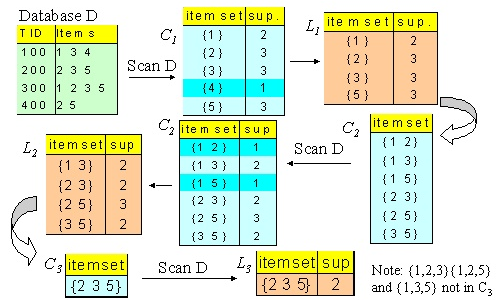

# Apriori Algorithm

The Apriori Algorithm is used in the field of data mining, for extracting *association rules*. An association rule is a statement that describes a relationship between items in a dataset, indicating that the presence of certain items in a transaction implies the presence of other items. This algorithm is implied mostly in market basket analysis, where the main purpose is to identify what products are frequently bought together and, given a certain "product_n", what's the probability that if a customer buys that product it will also buy "product_m".

### Terminology

- **itemset**: It's a collection of one or more items that appear together in a transaction within a dataset.
- **support**: The proportion of transactions in the dataset that contain a particular itemset. It indicates how frequently an itemset appears in the dataset.
- **Threshold**: It's a value that we define to consider just the itemsets with the support greater than it. 
- **candidates**: a list of itemsets, each composed by N items created by all the possible combinations of those N items.
- **wall**: a list of itemsets, each omposed by N items created by filtering out from the candidates all the itemsets with the support below the threshold.

### How the algorithm works

1. Step: Starting from the wall (at the beginning the wall will be the initial list of transactions) we define the candidates of a certain N (At the beginning N = 1, so each itemset will be a single element).
2. we calculate the support of each itemset obtained (n.b. If an itemset contains another itemset previously defined by candidates of N-1, the itemset is cut off without even defining the support).
3. We cut off all the itemsets with the support lower or equal to the threshold 
4. We build the wall based on the previous filtering.
5. Iterate the process until the wall is empty.

    

### Input
You can put every transaction you want in the file 'input.txt'. each item is separated by a ','.

### Output
The structure of the output will be:
- N: It specifies the iteration.
- below_list: It is a list of all the itemsets with the support < threshold.
- candidate_list: list of the candidates for iteration N.
- wall_list: list of all the itemsets of the wall for iteration N. 